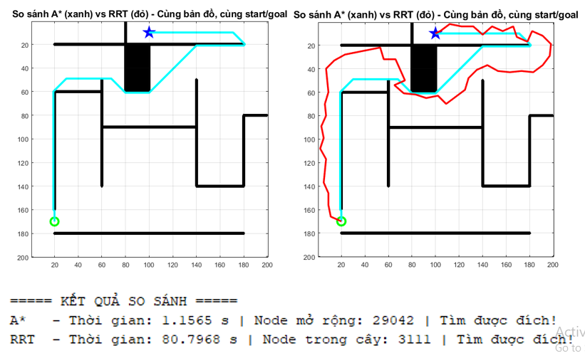

# Evaluate-two-robot-navigation-algorithms-A-Star-and-RRT

This repository is built upon the foundational RobotNavigation simulation by [jmiseikis](https://github.com/jmiseikis/RobotNavigation), which provides MATLAB implementations and visualizations of A* and RRT algorithms for robot navigation. We have extended it to include RRT-Connect, an enhanced bidirectional variant, along with comprehensive comparisons, additional maps, and improved performance analysis tools.

This repository contains the complete source code, simulation environments, and graphical user interface (GUI) developed for the research project titled **"Evaluation of Two Robot Navigation Algorithms: A* and Real-Time Randomized Path Planning (RRT)"**, implemented in **MATLAB**.

The project successfully implements, visualizes, and compares the performance of three well-known path-planning algorithms:
- **A*** (A-star)
- **RRT** (Rapidly-exploring Random Tree)
- **RRT-Connect** (Bidirectional RRT)

through an interactive 2D simulation.

## Usage

All algorithms are implemented in MATLAB. Run each file to see charts and paths in maps.

- `chart.m`: Generates performance comparison charts (e.g., execution time, path length, node count across multiple maps).
- `compare_Astar_RRT.m`: Runs side-by-side simulations of A*, RRT, and RRT-Connect on selected maps with real-time visualization.

To launch the full interactive GUI (extended from the original Astar_GUI and RRT_gui):
- Run `main_gui.m` (our enhanced unified interface).
- Select algorithm, load a map, set parameters, and visualize execution.
- Use the "Explain" button for step-by-step algorithm details.

For basic standalone runs (from original repo):
- `Astar_GUI`: A* simulation.
- `RRT_gui`: Classic RRT simulation.

Add the repository directory to MATLAB's path before running.

## Key Features

- Interactive GUI built with MATLAB App Designer (unified interface extending original GUIs)
- Multiple pre-defined 2D maps (grid-based and continuous spaces, including originals like simple mazes and our additions like cluttered/narrow environments)
- Real-time visualization of algorithm execution (path expansion, node growth, collision checks)
- Side-by-side comparison of path quality, computation time, and node expansion
- Parameter tuning for each algorithm (heuristic weight for A*, max iterations & step size for RRT variants)
- Path smoothing post-processing option for RRT-based methods
- Automatic performance logging and statistical reporting (export to CSV for further analysis)

## Key Findings

### A* Algorithm
- **Guarantees optimality**: Always finds the shortest path if one exists
- Highly reliable and stable execution time (linear growth with map size)
- Excellent performance in structured/grid environments and maps with dead-ends
- Drawback: High memory usage due to large number of explored nodes in complex maps
- **Best suited for**: Static, known environments where optimal path is required

### RRT (Classic)
- Extremely efficient in large continuous spaces with few obstacles
- Low node count compared to A* in open areas
- Highly probabilistic → unstable results (path length and success rate vary significantly)
- Struggles in narrow passages and cluttered environments
- **Best suited for**: Fast exploration in high-dimensional or continuous spaces

### RRT-Connect
- Significant improvement over classic RRT
- Bidirectional tree growth dramatically reduces planning time and node count
- In many scenarios, **faster than A*** while exploring far fewer nodes
- Still produces jagged, sub-optimal paths due to randomness
- **Best suited for**: Real-time planning in large, complex, or dynamic environments where speed is priority

